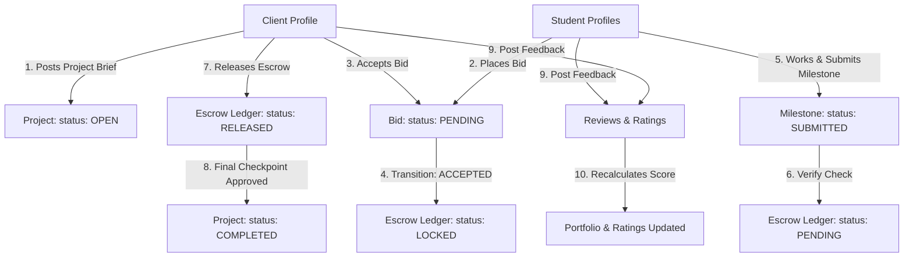
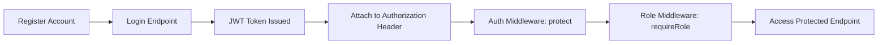
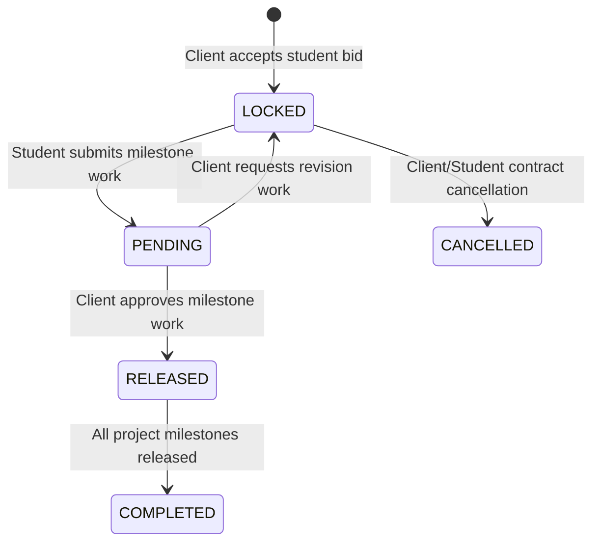
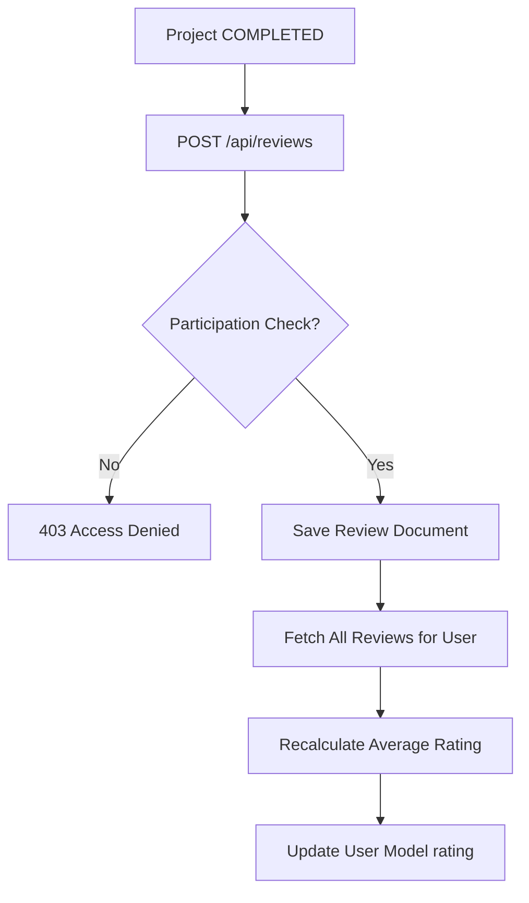
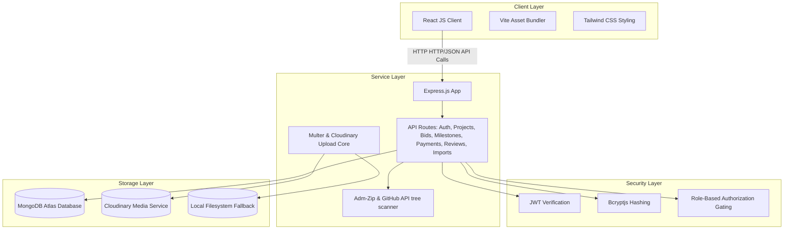
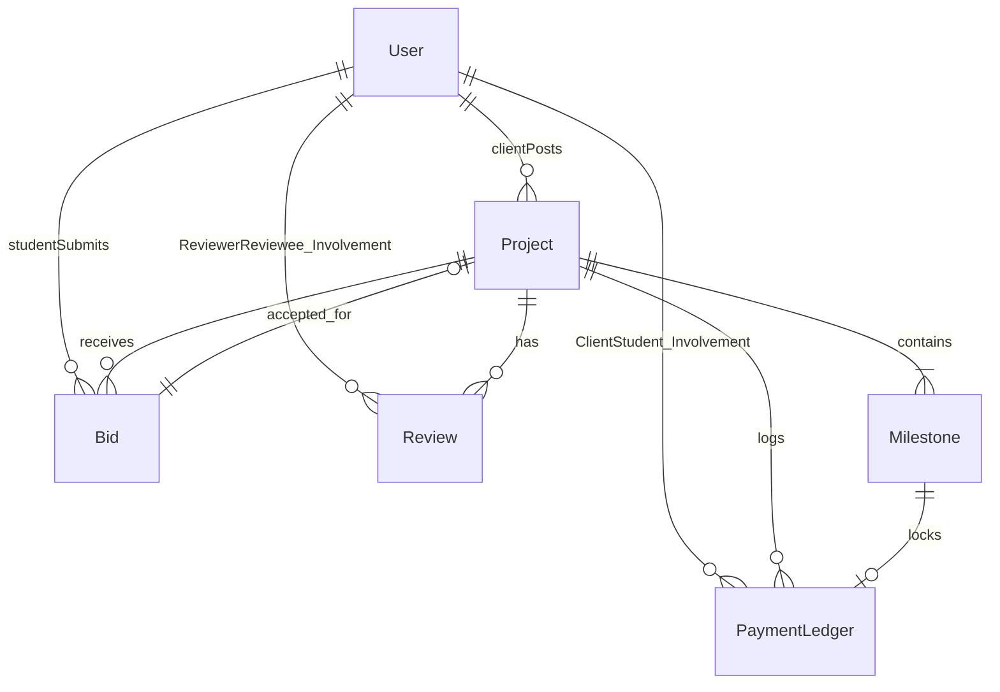

# Bid-Hub

[](https://nodejs.org/)
[](https://react.dev/)
[](https://www.mongodb.com/cloud/atlas)
[](https://opensource.org/licenses/MIT)
[]()

> A hand-crafted, student-focused freelance bidding marketplace built on the MERN stack. Designed with a premium editorial aesthetic, keeping marketplace interactions transparent and honest through a simulated escrow payment ledger.

---

## Table of Contents
1. [Overview](#1-overview)
2. [Marketplace Core Workflows](#2-marketplace-core-workflows)
3. [Key Features](#3-key-features)
4. [System Architecture](#4-system-architecture)
5. [Database Entity Relationship Diagram](#5-database-entity-relationship-diagram)
6. [Project Structure](#6-project-structure)
7. [API Endpoint Documentation](#7-api-endpoint-documentation)
8. [Security & Validation Mechanics](#8-security--validation-mechanics)
9. [Environment Configuration](#9-environment-configuration)
10. [Installation & Setup](#10-installation--setup)
11. [Testing & Verification Suite](#11-testing--verification-suite)
12. [Visual Previews & Screen Flow](#12-visual-previews--screen-flow)
13. [Production Deployment Guide](#13-production-deployment-guide)
14. [Roadmap & Future Extensions](#14-roadmap--future-extensions)
15. [Contributing Guidelines](#15-contributing-guidelines)
16. [License](#16-license)

---

## 1. Overview

**Bid-Hub** is a localized MERN-stack freelance marketplace where client organizations post small, technical briefs (e.g. web layouts, UI animations, database scripts) and student engineers compete through proposal bidding.

Rather than trying to replicate an enterprise-level SaaS suite, Bid-Hub focuses on delivering a high-fidelity, polished capstone product that addresses the critical safety concerns of student freelancing:
* **Simulated Escrow Ledgers**: Guarantees payment transparency by locking funds on contract signing and releasing them progressively upon client milestone sign-off.
* **Code-Level Manifest Generation**: Integrates ZIP uploads and GitHub repository scanning to list file sizes and directory layouts without duplicating heavy codebase binaries inside MongoDB.
* **Hand-crafted Editorial Identity**: Features custom warm cream and dark charcoal layouts, strong magazine-style typography, and generous spacing in place of generic admin dashboards.

---

## 2. Marketplace Core Workflows

The application coordinates student reputation growth, client milestone verification, and simulated ledger balances through three isolated state machines.

### High-Level Workflow Flowchart


### Authentication & Access Gating Flow


### Escrow State Lifecycle


### Review Abuse Protection & Reputation Calculation


---

## 3. Key Features

### 🔐 Authentication & Access Gating
* **Secure Registration**: Form validations for student `.edu` and client emails.
* **Role Gating**: Strict client and student dashboard splits preventing students from posting projects or clients from placing bids.
* **JWT Persistence**: Lightweight auth headers saved locally, auto-validating user state on application reload.

### 💼 Project & Bidding System
* **Timeline milestones**: Clients split budget distributions across multiple milestone checkpoints.
* **Search & Filter**: Real-time project search by categories, keywords, and skill tags.
* **Interactive Proposals**: Student bids specify price estimates, timeline projections, and custom proposals.

### 🛡️ Escrow & Milestone Management
* **Simulation Ledger**: Tracks locked client funds and released student payouts dynamically.
* **Submissions Core**: Students upload proof of work triggers changing milestone states.
* **Contract Completion**: Once the final milestone is signed off, PM balances settle, and project statuses update.

### 📂 Attachment & Code Manifest Indexing
* **Cloudinary Media**: Stores profile avatars and PDF brief details in Cloudinary with disk storage fallback.
* **GitHub Repository Scanning**: Indexes repository branches recursively using GitHub API to return file manifests.
* **Zip File Parser**: Uses node filesystem streams to parse ZIP file paths and metadata.
* **File Guardrails**: Rejects zip extractions or remote trees containing more than **20 files** or exceeding **50MB** in size, ignoring packages like `node_modules`, `.git`, `dist`, `build`, etc.

---

## 4. System Architecture

The application layout decouples the single-page application from the state-controlled REST API service layer.



---

## 5. Database Entity Relationship Diagram

The schemas enforce relational integrity across MongoDB collections using document model object references (`ObjectId`).



---

## 6. Project Structure

```text
├── backend/
│   ├── config/              # Database connections & Cloudinary file configuration
│   ├── middleware/          # JWT authorization gating & role validation rules
│   ├── models/              # Mongoose schemas (User, Project, Bid, Milestones, Ledger)
│   ├── routes/              # Express endpoint routers
│   ├── tests/               # Postman collection test scripts
│   └── index.js             # Express application entrypoint
├── frontend/
│   ├── app/
│   │   ├── components/
│   │   │   ├── pages/       # SPA Views (Browse, Dashboards, Landing, Auth, Profile)
│   │   │   ├── ui/          # Exactly 15 required Tailwind primitives
│   │   │   ├── Nav.jsx      # Sticky top-navigation control
│   │   │   └── EscrowDrawer # Side-drawer simulated payment tracking panel
│   │   └── App.jsx          # Route control, state context, theme managers
│   └── styles/              # Editorial typography & theme systems
├── package.json             # Workspace dependencies config
└── vite.config.js           # Client bundler configurations & dev server proxy maps
```

---

## 7. API Endpoint Documentation

### Authentication API
| Method | Endpoint | Description | Auth Req |
| :--- | :--- | :--- | :--- |
| `POST` | `/api/auth/register` | Register a new user | Public |
| `POST` | `/api/auth/login` | Login user and issue JWT | Public |
| `GET` | `/api/auth/me` | Fetch active user credentials | Private (JWT) |

### User Profile API
| Method | Endpoint | Description | Auth Req |
| :--- | :--- | :--- | :--- |
| `GET` | `/api/users/:id` | Fetch public profile and reviews, increments views | Public |
| `PATCH` | `/api/users/:id` | Update biography details and skill tags | Private (Owner) |
| `POST` | `/api/users/avatar` | Upload profile image to Cloudinary/Local | Private (JWT) |

### Project API
| Method | Endpoint | Description | Auth Req |
| :--- | :--- | :--- | :--- |
| `GET` | `/api/projects` | List projects with search query/category filters | Public |
| `POST` | `/api/projects` | Post new project brief with nested milestones | Private (Client) |
| `GET` | `/api/projects/:id` | Fetch project brief details and milestones | Public |
| `PATCH` | `/api/projects/:id` | Update project brief details | Private (Client Owner) |
| `DELETE` | `/api/projects/:id` | Remove project brief | Private (Client Owner) |

### Bidding API
| Method | Endpoint | Description | Auth Req |
| :--- | :--- | :--- | :--- |
| `POST` | `/api/projects/:id/bids` | Submit bid on open brief | Private (Student) |
| `GET` | `/api/projects/:id/bids` | List bids (Client sees all; Student sees own) | Private (JWT) |
| `PATCH` | `/api/bids/:id/accept` | Accept bid and lock milestones in escrow | Private (Client Owner) |
| `PATCH` | `/api/bids/:id/reject` | Reject bid | Private (Client Owner) |

### Milestone & Payment API
| Method | Endpoint | Description | Auth Req |
| :--- | :--- | :--- | :--- |
| `PATCH` | `/api/milestones/:id/submit` | Submit work for review (Ledger: PENDING) | Private (Student assigned) |
| `PATCH` | `/api/milestones/:id/release` | Approve and release funds (Ledger: RELEASED) | Private (Client Owner) |
| `POST` | `/api/milestones/projects/:id/milestones` | Add milestone manually | Private (Client Owner) |
| `GET` | `/api/payments` | Fetch simulated escrow stats and history list | Private (JWT) |

### Reviews & Upload API
| Method | Endpoint | Description | Auth Req |
| :--- | :--- | :--- | :--- |
| `POST` | `/api/reviews` | Leave rating review and update average score | Private (JWT) |
| `GET` | `/api/reviews/users/:id/reviews` | Get reviews left for user | Public |
| `POST` | `/api/uploads/image` | Upload single image | Private (JWT) |
| `POST` | `/api/uploads/files` | Upload multiple files | Private (JWT) |
| `POST` | `/api/import/local` | Parse ZIP file into file manifest metadata | Private (JWT) |
| `POST` | `/api/import/github` | Scan GitHub repo tree into file manifest metadata | Private (JWT) |

---

## 8. Security & Validation Mechanics

### 🛡️ Schema Enum Constraints
Invalid document states are blocked at the database database schema layer using Mongoose validator constraints:
* **Project Status**: Enforced as `["OPEN", "ASSIGNED", "IN_PROGRESS", "COMPLETED", "CANCELLED"]`.
* **Bid Status**: Enforced as `["PENDING", "ACCEPTED", "REJECTED", "WITHDRAWN"]`.
* **Milestone Status**: Enforced as `["PENDING", "SUBMITTED", "APPROVED", "RELEASED"]`.
* **Payment Ledger**: Enforced as `["LOCKED", "PENDING", "RELEASED", "COMPLETED", "CANCELLED"]`.

### 🛡️ Review Abuse Protection
To prevent feedback gaming or falsified listings, `POST /api/reviews` executes four validations:
1. The associated project status must be `COMPLETED`.
2. The reviewer must be a validated participant on the project (either the posting client or the assigned student).
3. The reviewee must be a validated participant on the project.
4. The database is checked to ensure no duplicate review exists from that reviewer for that project.

### 🛡️ Upload & Import Protections
* **Public GitHub URL Trees**: The repository imports scanner does not run shell scripts or perform `git clone`. Instead, it reads file tree listings from GitHub’s public API trees.
* **Strict Size and Count Guardrails**: Scans reject codebases with more than **20 files** or overall dimensions exceeding **50MB**, preventing MongoDB storage depletion.
* **Exclusion Filters**: Systemmatically ignores system and cache files (`node_modules`, `.git`, `dist`, `build`, etc.).

---

## 9. Environment Configuration

Create a `.env` configuration file in the project directory root:

```env
# Express Core Settings
NODE_ENV=development
PORT=5000

# Database Settings
MONGODB_URI=mongodb://localhost:27017/bidhub

# Token Cryptography
JWT_SECRET=your_long_cryptographically_secure_development_jwt_secret_key

# Cloudinary Upload Settings (Fallback configuration uses disk storage if unset)
CLOUDINARY_CLOUD_NAME=your_cloudinary_cloud_name
CLOUDINARY_API_KEY=your_cloudinary_api_key
CLOUDINARY_API_SECRET=your_cloudinary_api_secret
```

---

## 10. Installation & Setup

Ensure you have **Node.js** (version 18 or above) and **MongoDB** installed and running on your system.

### Step 1: Clone Repository
```bash
git clone https://github.com/your-username/BidHub.git
cd BidHub
```

### Step 2: Install Project Dependencies
The project uses shared configurations at the root level.
```bash
npm install
```

### Step 3: Seed Database
Populate the database with validation profiles (Student: `rohan@rvce.edu`, Client: `siddharth@rvceinc.com`, password: `password123`) and project states:
```bash
node backend/seed.js
```

### Step 4: Run Application in Development
Launch the Express API and the Vite development client in parallel:
```bash
npm run dev:all
```
* Client interface loads at `http://localhost:5173`.
* Express API runs at `http://localhost:5000` with Vite proxy handling `/api/*` forwarding.

---

## 11. Testing & Verification Suite

API validation checks are maintained in a runnable Postman test collection.

* **Collection Path**: [backend/tests/BidHub_Postman_Collection.json](file:///C:/Suntek/BidHub/backend/tests/BidHub_Postman_Collection.json)

### Executing API Tests
1. Import `BidHub_Postman_Collection.json` into Postman, Bruno, or Thunder Client.
2. Ensure your local database is running and the seeder script (`node backend/seed.js`) has been executed.
3. Start the Express server (`npm run server`).
4. Run the Collection in Postman. The test script saves variables dynamically, performing login token updates automatically.

### Included Test Assertions
* **Authentication checks**: Negative checks verifying `401` states on wrong passwords or expired JWT authorization tokens.
* **Role Gating checks**: Verifies access restrictions blocking students from posting briefs (`403`) and clients from placing bids (`403`).
* **Milestone Releases Gating**: Asserts that student profiles cannot release their own escrow balances (`403`).
* **Review Protection Checks**: Verifies that feedback forms fail for uncompleted projects and blocks duplicate reviews on completed projects (`400`).
* **Import File Limits**: Verifies that ZIP and GitHub imports exceeding 20 files are rejected (`400`).

---

## 12. Visual Previews & Screen Flow

### Client Dashboard View
```text
┌────────────────────────────────────────────────────────────────────────┐
│ Client Dashboard · RVCE Inc.                                          │
│ Welcome, Siddharth Malhotra                                            │
├────────────────────────────────────────────────────────────────────────┤
│ Posted projects: 3  |  Active Gigs: 1  |  Escrow Locked: ₹7,500         │
├────────────────────────────────────────────────────────────────────────┤
│  Incoming Proposals:                                                  │
│  - Rohan Sharma: ₹23,500 for landing page redesign  [ Review ] [Accept]│
│                                                                        │
│  Milestone Approvals:                                                  │
│  - UI Mockup integration (₹7,500)                 [Release Escrow]     │
└────────────────────────────────────────────────────────────────────────┘
```

### Student Dashboard View
```text
┌────────────────────────────────────────────────────────────────────────┐
│ Student Dashboard · Verified RVCE Profile                              │
│ Welcome, Rohan Sharma                                                  │
├────────────────────────────────────────────────────────────────────────┤
│ Balance: ₹8,000  |  Active: 1  |  Open Bids: 1  |  Profile Views: 12    │
├────────────────────────────────────────────────────────────────────────┤
│  Ongoing Gigs:                                                         │
│  - RVCE Ride Share dashboard: 50% milestone released                   │
│    - Layout design integration (₹7,500)           [ Under Review ]     │
│    - API endpoints implementation (₹7,500)        [ Submit Work  ]     │
└────────────────────────────────────────────────────────────────────────┘
```

---

## 13. Production Deployment Guide

Follow these steps to deploy the application structure to production.

### Database (MongoDB Atlas)
1. Register a cluster on [MongoDB Atlas](https://www.mongodb.com/cloud/atlas).
2. Whitelist your production server IP address in the network connection firewall rules.
3. Copy your connection URI and configure the MONGODB_URI production environment variable.

### Media (Cloudinary)
1. Create a media account on [Cloudinary](https://cloudinary.com).
2. Fetch your cloud name, API key, and API secret keys.
3. Configure the environment variables to verify Cloudinary media upload routes.

### Backend (Render or Railway)
1. Connect your repository to **Render** or **Railway**.
2. Select a Web Service deployment. Build command: `npm install`. Startup command: `npm run server`.
3. Set your production environment variables in their dashboard config dashboard.

### Frontend (Vercel)
1. Deploy your repository to **Vercel**.
2. Vercel automatically reads `vite.config.js` config parameters.
3. Configure proxy overrides or rewrite API calls to direct traffic to your backend URL.
4. Build command: `npm run build`. Output directory: `dist/`.

---

## 14. Roadmap & Future Extensions

* [ ] **Stripe Escrow Integration**: Replace the simulated payment ledger with real Stripe Connect split payment contracts.
* [ ] **In-App Messaging**: Real-time communication channels using WebSockets (`Socket.io`) between students and clients during active milestones.
* [ ] **Collaborative Team Bidding**: Support student-team bids for larger, multi-student projects.
* [ ] **Automated Matching**: Provide automated skill-based project recommendation notifications to students based on profile listings.
* [ ] **Verified Institution Gating**: Limit registrations to students with verified university email addresses via automated verification codes.

---

## 15. Contributing Guidelines

We welcome contributions to Bid-Hub! Follow these steps to submit pull requests:
1. Fork this repository.
2. Create a feature branch: `git checkout -b feature/NewFeatureName`.
3. Verify your changes compile successfully: `npm run build`.
4. Commit your files: `git commit -m "Added descriptive changes summary"`.
5. Push changes: `git push origin feature/NewFeatureName`.
6. Submit a Pull Request for review.

---

## 16. License

This project is licensed under the MIT License - see the [LICENSE](LICENSE) file details.
© Bid-Hub Team RVCE · Bengaluru, India.