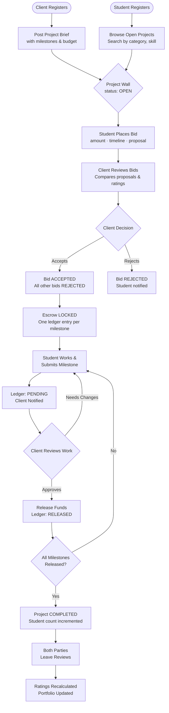
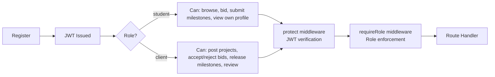
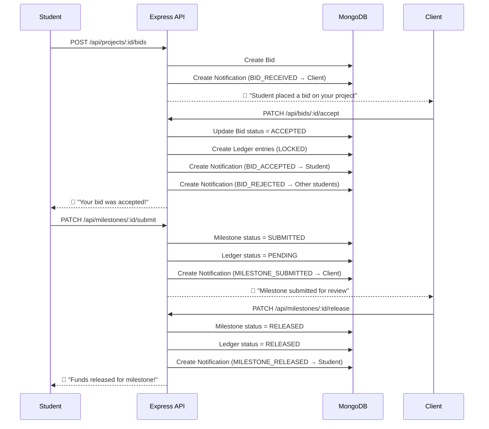
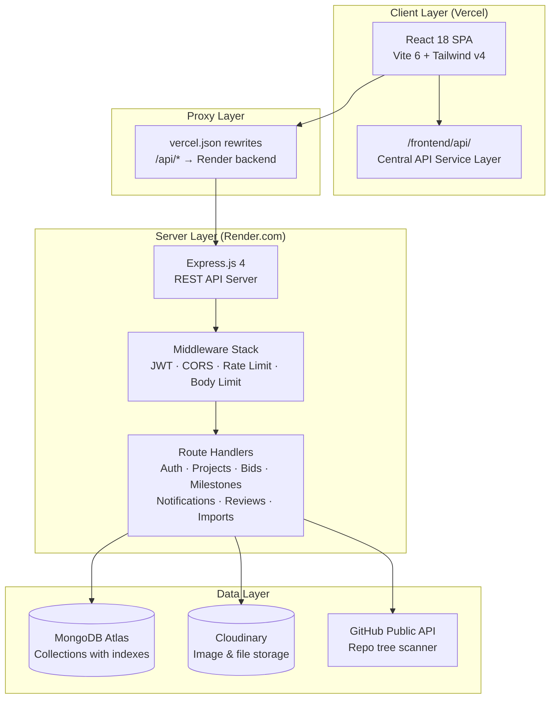
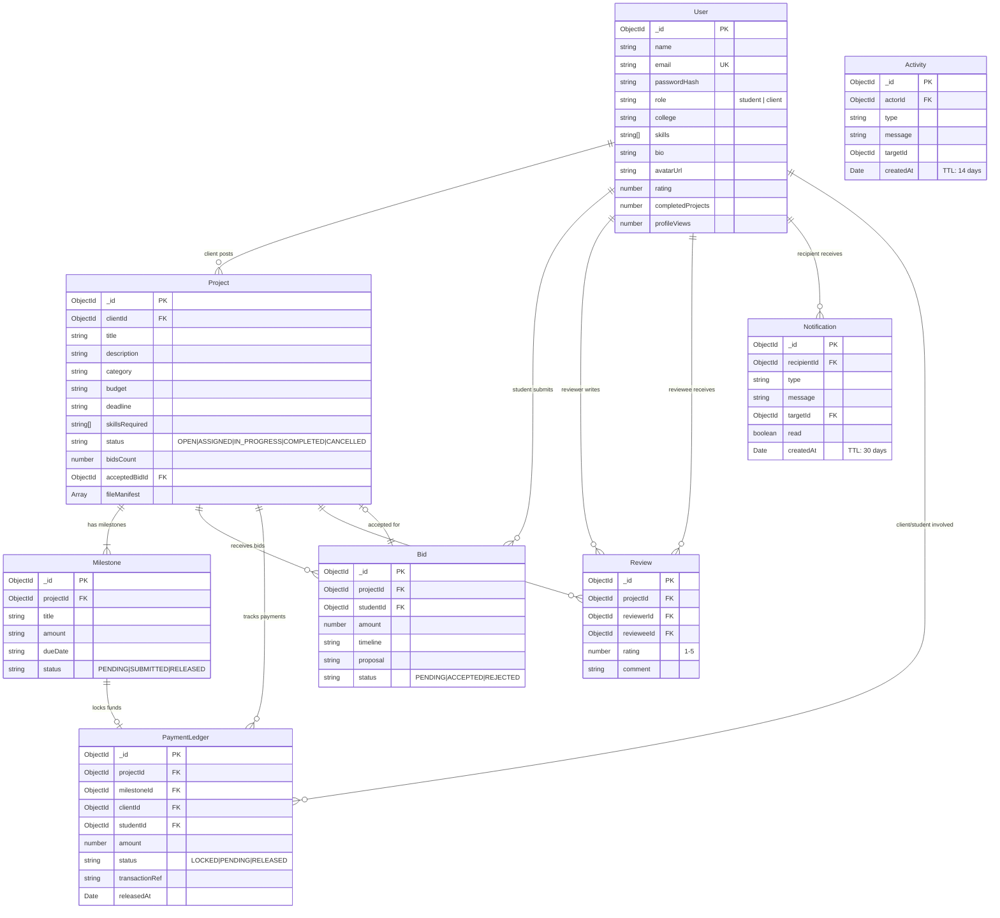

<div align="center">

# Bid·Hub

### A Student-Focused Freelance Bidding Marketplace

[](https://nodejs.org/)
[](https://react.dev/)
[](https://www.mongodb.com/cloud/atlas)
[](https://expressjs.com/)
[](https://vitejs.dev/)
[](https://tailwindcss.com/)
[](https://cloudinary.com/)
[](#)
[](https://vercel.com)

**Bid-Hub** is a full-stack MERN marketplace where clients post technical project briefs and students compete through structured bidding. Work execution is managed through milestone tracking, simulated escrow payments, portfolio building, peer reviews, and reputation scoring.

[Live Demo](#deployment) · [API Docs](#7-api-endpoint-documentation) · [Quick Start](#10-installation--setup) · [Deploy](#13-production-deployment-guide)

</div>

---

## Table of Contents

1. [Project Overview & Problem Statement](#1-project-overview--problem-statement)
2. [Marketplace Core Workflows](#2-marketplace-core-workflows)
3. [Key Features](#3-key-features)
4. [System Architecture](#4-system-architecture)
5. [Database Entity Relationship Diagram](#5-database-entity-relationship-diagram)
6. [Project Structure](#6-project-structure)
7. [API Endpoint Documentation](#7-api-endpoint-documentation)
8. [Security & Validation Mechanics](#8-security--validation-mechanics)
9. [Environment Configuration](#9-environment-configuration)
10. [Installation & Setup](#10-installation--setup)
11. [Testing & Verification Suite](#11-testing--verification-suite)
12. [Visual Previews & Screen Flow](#12-visual-previews--screen-flow)
13. [Production Deployment Guide](#13-production-deployment-guide)
14. [Roadmap & Future Extensions](#14-roadmap--future-extensions)
15. [Contributing Guidelines](#15-contributing-guidelines)


---

## 1. Project Overview & Problem Statement

### The Problem

Student freelance work is informal, opaque, and unprotected. Students share their work without guarantees of payment. Clients post vague briefs and ghost after receiving deliverables. There is no structured way for students to build verifiable, professional portfolios during their college years.

### The Solution

**Bid-Hub** addresses this with four core mechanisms:

| Mechanism | Problem Solved |
|-----------|---------------|
| **Structured Bidding** | Clients articulate requirements precisely; students compete on merit, not connections |
| **Simulated Escrow Ledger** | Milestones lock funds before work begins; releases require explicit client sign-off |
| **Reputation System** | Ratings, reviews, and completed project counts are immutable and publicly visible |
| **Portfolio Import** | GitHub repositories and ZIP archives build a verifiable, audit-ready work history |

### Design Philosophy

Bid-Hub is deliberately **scoped as a capstone project** — not a SaaS product. It prioritizes:
- Clean, readable code over premature optimization
- Real-world security practices (JWT, CORS, rate limiting, input sanitization)
- A premium editorial aesthetic that treats student work with professional dignity
- Simulated payments (no Stripe or real money) to keep complexity manageable

---

## 2. Marketplace Core Workflows

### End-to-End Bidding & Escrow Workflow



### Authentication & Role-Based Access Control



### Escrow State Machine

```mermaid
stateDiagram-v2
    [*] --> LOCKED : Client accepts student bid\n(one ledger entry per milestone)
    LOCKED --> PENDING : Student submits milestone work
    PENDING --> RELEASED : Client approves & releases funds
    RELEASED --> [*] : Funds credited to student balance
    
    note right of LOCKED : Simulated escrow\n(no real money)
    note right of RELEASED : If all milestones released:\nProject → COMPLETED
```

### Notification Flow



---

## 3. Key Features

### For Students
- 🔍 **Browse & Search** — Filter open projects by category, skill level, and keywords
- 💬 **Structured Bidding** — Submit proposals with amount, timeline, and pitch
- 📋 **Milestone Tracking** — Submit individual work stages; track escrow per milestone
- 💰 **Simulated Earnings** — Real-time escrow ledger showing locked/pending/released funds
- 🏆 **Reputation Building** — Rating score, completed project count, profile views
- 🗂️ **Portfolio Import** — Index GitHub repos or ZIP archives as project manifests

### For Clients
- 📝 **Project Posting** — Rich project briefs with milestones, budget, deadline, attachments
- 👥 **Bid Management** — Compare all proposals side-by-side; accept one to reject all others
- ✅ **Milestone Approval** — Review submitted work; release funds one milestone at a time
- ⭐ **Review System** — Rate student work after project completion

### Platform
- 🔔 **Live Notifications** — Real-time bell with unread count; 8 notification types
- 🔒 **Secure Auth** — JWT + bcrypt; rate limiting; no hardcoded secrets
- 📦 **File Upload** — Cloudinary primary; local disk fallback
- 🌙 **Dark/Light Mode** — Persistent editorial warm theme
- 📱 **Responsive** — Mobile-first Tailwind layout

---

## 4. System Architecture



### Technology Stack

| Layer | Technology | Purpose |
|-------|-----------|---------|
| Frontend | React 18 + Vite 6 | SPA, component tree, hot reload |
| Styling | Tailwind CSS v4 | Utility-first styling, editorial theme |
| Backend | Express.js 4 | REST API, middleware, routing |
| Database | MongoDB + Mongoose | Document storage with indexed schemas |
| Auth | JWT + bcryptjs | Stateless auth, password hashing |
| File Storage | Cloudinary + Multer | Image/file uploads with local fallback |
| Imports | GitHub API + adm-zip | Repository manifest indexing |
| Notifications | MongoDB (polling) | In-app notifications with TTL expiry |
| Rate Limiting | express-rate-limit | Brute force protection |
| Deployment | Vercel + Render | Frontend CDN + backend web service |

---

## 5. Database Entity Relationship Diagram



### MongoDB Index Strategy

| Collection | Index | Purpose |
|-----------|-------|---------|
| `users` | `{ email: 1 }` unique | Fast login lookup |
| `users` | `{ role: 1, rating: -1 }` | Leaderboard queries |
| `projects` | `{ status: 1, createdAt: -1 }` | Project wall browse |
| `projects` | `{ clientId: 1, status: 1 }` | Client dashboard |
| `projects` | `{ title: "text", description: "text" }` | Full-text search |
| `bids` | `{ projectId: 1, status: 1 }` | Client bid review |
| `bids` | `{ studentId: 1, status: 1 }` | Student bid history |
| `bids` | `{ projectId: 1, studentId: 1 }` unique | Prevent duplicate bids |
| `reviews` | `{ revieweeId: 1, createdAt: -1 }` | Profile page reviews |
| `reviews` | `{ projectId: 1, reviewerId: 1 }` unique | Prevent duplicate reviews |
| `paymentledgers` | `{ projectId: 1 }` | Escrow drawer |
| `paymentledgers` | `{ studentId: 1, status: 1 }` | Earnings dashboard |
| `notifications` | `{ recipientId: 1, read: 1, createdAt: -1 }` | Unread count bell |
| `notifications` | `{ createdAt: 1 }` TTL 30d | Auto-expire old notifications |
| `activities` | `{ createdAt: 1 }` TTL 14d | Auto-expire old activities |

---

## 6. Project Structure

```text
Bid-Hub/
├── backend/                      # Express API server
│   ├── config/
│   │   ├── db.js                 # Mongoose connection with retry logic
│   │   └── cloudinary.js         # Multer + Cloudinary storage config
│   ├── middleware/
│   │   └── auth.js               # protect (JWT verify) + requireRole (RBAC)
│   ├── models/
│   │   ├── User.js               # User schema + email/role indexes
│   │   ├── Project.js            # Project schema + status/text indexes
│   │   ├── Bid.js                # Bid schema + unique projectId+studentId index
│   │   ├── Milestone.js          # Milestone schema
│   │   ├── PaymentLedger.js      # Escrow ledger schema + indexes
│   │   ├── Review.js             # Review schema + duplicate-prevention index
│   │   ├── Notification.js       # Notification schema + TTL index
│   │   └── Activity.js           # Activity feed schema + TTL index
│   ├── routes/
│   │   ├── auth.js               # /api/auth: register, login, me (rate limited)
│   │   ├── users.js              # /api/users: profile, avatar upload
│   │   ├── projects.js           # /api/projects: CRUD, search with regex escape
│   │   ├── bids.js               # /api/bids & /api/projects/:id/bids
│   │   ├── milestones.js         # /api/milestones: submit, release, create
│   │   ├── payments.js           # /api/payments: escrow ledger
│   │   ├── reviews.js            # /api/reviews: create, get by user
│   │   ├── uploads.js            # /api/uploads: file attachments
│   │   ├── imports.js            # /api/import: ZIP + GitHub manifest (rate limited)
│   │   └── notifications.js      # /api/notifications: CRUD + mark read
│   ├── tests/
│   │   └── BidHub_Postman_Collection.json  # Full API test suite
│   ├── seed.js                   # Database seeder with demo accounts
│   ├── .env.example              # Environment variable template
│   ├── package.json              # Backend dependencies
│   └── index.js                  # Express app entry point
│
├── frontend/                     # React SPA (Vite)
│   ├── api/                      # Central API service layer
│   │   ├── authApi.js            # loginUser, registerUser, getMe
│   │   ├── projectApi.js         # getProjects, getProject, createProject, placeBid
│   │   ├── bidApi.js             # acceptBid, rejectBid
│   │   ├── userApi.js            # getUserProfile, updateUserProfile, uploadAvatar
│   │   └── notificationApi.js    # getNotifications, markRead, markAllRead
│   ├── app/
│   │   ├── components/
│   │   │   ├── pages/
│   │   │   │   ├── Landing.jsx       # Homepage with hero & activity feed
│   │   │   │   ├── Browse.jsx        # Project marketplace with filters
│   │   │   │   ├── ProjectDetail.jsx # Project page with bidding
│   │   │   │   ├── PostProject.jsx   # Project creation form
│   │   │   │   ├── StudentDashboard.jsx # Student: bids, milestones, earnings
│   │   │   │   ├── ClientDashboard.jsx  # Client: projects, bid review, releases
│   │   │   │   ├── Profile.jsx       # User profile with reviews
│   │   │   │   └── Auth.jsx          # Login + Register with role redirect
│   │   │   ├── ui/               # Tailwind UI primitives (Button, Input, etc.)
│   │   │   ├── Nav.jsx           # Sticky nav with notification bell
│   │   │   └── EscrowDrawer.jsx  # Side drawer payment ledger
│   │   └── App.jsx               # SPA router + auth state management
│   └── styles/                   # Editorial warm theme CSS
│
├── index.html                    # SPA entry point
├── vite.config.js                # Vite + dev server proxy config
├── vercel.json                   # Vercel: /api/* → Render proxy + SPA fallback
├── render.yaml                   # Render: one-click backend deployment
├── package.json                  # Root workspace (frontend deps)
├── .gitignore                    # backend/.env excluded
├── .gitattributes                # LF line endings enforced
└── README.md                     # This file
```

---

## 7. API Endpoint Documentation

### Authentication

| Method | Endpoint | Description | Auth | Rate Limit |
|--------|----------|-------------|------|-----------|
| `POST` | `/api/auth/register` | Register new user (student or client) | Public | 10/15min |
| `POST` | `/api/auth/login` | Authenticate and receive JWT | Public | 10/15min |
| `GET` | `/api/auth/me` | Get current authenticated user profile | JWT | — |

**Register/Login request body:**
```json
{
  "name": "Rohan Sharma",
  "email": "rohan@rvce.edu.in",
  "password": "securepassword",
  "role": "student",
  "college": "RVCE Bengaluru"
}
```

---

### Users & Profiles

| Method | Endpoint | Description | Auth |
|--------|----------|-------------|------|
| `GET` | `/api/users/:id` | Fetch public profile (increments views) | Public |
| `PATCH` | `/api/users/:id` | Update bio, skills, college | JWT (Owner) |
| `POST` | `/api/users/avatar` | Upload profile image to Cloudinary | JWT |

---

### Projects

| Method | Endpoint | Description | Auth |
|--------|----------|-------------|------|
| `GET` | `/api/projects` | List open projects (search, category, page) | Public |
| `POST` | `/api/projects` | Create new project brief | JWT (Client) |
| `GET` | `/api/projects/:id` | Get project details + milestones | Public |
| `PATCH` | `/api/projects/:id` | Update project details | JWT (Client Owner) |
| `DELETE` | `/api/projects/:id` | Delete project | JWT (Client Owner) |

**Query params:** `?search=react&category=Web+Development&page=2`

---

### Bidding

| Method | Endpoint | Description | Auth |
|--------|----------|-------------|------|
| `POST` | `/api/projects/:id/bids` | Place a bid on a project | JWT (Student) |
| `GET` | `/api/projects/:id/bids` | Get bids (Client: all; Student: own) | JWT |
| `PATCH` | `/api/bids/:id/accept` | Accept bid → lock escrow, reject others | JWT (Client Owner) |
| `PATCH` | `/api/bids/:id/reject` | Reject a specific bid | JWT (Client Owner) |

**Bid request body:**
```json
{
  "amount": 25000,
  "timeline": "3 weeks",
  "proposal": "I've built 5 similar dashboards using React and Chart.js..."
}
```

---

### Milestones & Escrow

| Method | Endpoint | Description | Auth |
|--------|----------|-------------|------|
| `POST` | `/api/milestones/projects/:id/milestones` | Add milestone to project | JWT (Client) |
| `PATCH` | `/api/milestones/:id/submit` | Submit milestone work (PENDING) | JWT (Student) |
| `PATCH` | `/api/milestones/:id/release` | Approve & release escrow (RELEASED) | JWT (Client) |
| `GET` | `/api/payments/projects/:id/ledger` | Get full escrow ledger for project | JWT |

---

### Reviews

| Method | Endpoint | Description | Auth |
|--------|----------|-------------|------|
| `POST` | `/api/reviews` | Post a review (project must be COMPLETED) | JWT |
| `GET` | `/api/reviews/users/:id/reviews` | Get all reviews for a user | Public |

**Review request body:**
```json
{
  "projectId": "...",
  "revieweeId": "...",
  "rating": 5,
  "comment": "Exceptional work, delivered ahead of schedule."
}
```

---

### Notifications

| Method | Endpoint | Description | Auth |
|--------|----------|-------------|------|
| `GET` | `/api/notifications` | Get all notifications (newest 30) | JWT |
| `GET` | `/api/notifications/unread-count` | Get unread notification count | JWT |
| `PATCH` | `/api/notifications/:id/read` | Mark single notification as read | JWT |
| `PATCH` | `/api/notifications/read-all` | Mark all notifications as read | JWT |
| `DELETE` | `/api/notifications/:id` | Delete a notification | JWT |

**Notification types:** `BID_RECEIVED` · `BID_ACCEPTED` · `BID_REJECTED` · `MILESTONE_SUBMITTED` · `MILESTONE_RELEASED` · `PROJECT_COMPLETED` · `REVIEW_RECEIVED` · `PROJECT_ASSIGNED`

---

### Imports & Uploads

| Method | Endpoint | Description | Auth | Limit |
|--------|----------|-------------|------|-------|
| `POST` | `/api/import/local` | Parse ZIP file manifest | JWT | 5/15min |
| `POST` | `/api/import/github` | Fetch GitHub repo tree manifest | JWT | 5/15min |
| `POST` | `/api/uploads/files` | Upload file attachments | JWT | — |

**Import limits:** max 20 files · max 50MB total · auto-excludes `node_modules`, `.git`, `dist`

---

### System

| Method | Endpoint | Description | Auth |
|--------|----------|-------------|------|
| `GET` | `/api/health` | Health check: status, uptime, environment | Public |
| `GET` | `/api/activities` | Global activity feed (last 30 events) | Public |
| `GET` | `/` | API root confirmation | Public |

**Health response:**
```json
{
  "status": "ok",
  "uptime": 3600,
  "timestamp": "2025-06-02T11:00:00.000Z",
  "environment": "production",
  "version": "1.0.0"
}
```

---

## 8. Security & Validation Mechanics

### Authentication Security

| Mechanism | Implementation |
|-----------|---------------|
| Password Hashing | `bcryptjs` with 10 salt rounds |
| Token Issuance | `jsonwebtoken` — HS256, 30-day expiry |
| JWT Secret Validation | Server **exits immediately** on startup if `JWT_SECRET` is missing or placeholder |
| Rate Limiting (Auth) | `express-rate-limit` — 10 req/15 min per IP on register + login |
| Email Normalization | Lowercase trim before comparison |

### Access Control

- **`protect` middleware**: Verifies JWT signature and expiry; attaches `req.user`
- **`requireRole(role)` middleware**: Checks `req.user.role` against required role; returns 403 if mismatched
- **Ownership checks**: Every mutation verifies the requesting user owns the resource (e.g. `project.clientId === req.user._id`)

### Input Validation & Sanitization

| Route | Validation |
|-------|-----------|
| Register | name, email, password (min 6), role (enum: student/client) all required |
| Bid | amount > 0, timeline, proposal all required; self-bid prevention |
| Review | rating 1–5, project must be COMPLETED, self-review blocked |
| Search | `escapeRegex()` sanitizes special characters; max 100 chars |
| Import | Max 20 files, 50MB size cap, MIME type filter |

### CORS & Transport Security

```
Allowed origins: CLIENT_URL env var (+ VERCEL_URL if set)
No open wildcard — requests from unknown origins receive CORS error
Body size limits: 10MB on all JSON + URL-encoded payloads
```

### Upload & Import Protections

- **Public GitHub URL Trees**: Reads file tree via GitHub API (no `git clone`, no shell execution)
- **Strict Size and Count Guardrails**: Reject repositories with > 20 files or > 50MB
- **Exclusion Filters**: `node_modules`, `.git`, `dist`, `build`, `coverage` auto-excluded
- **MIME Type Validation**: Multer file filter enforces image/PDF/ZIP types

### Additional Hardening

- **Rate Limiting (Imports)**: 5 req/15 min per IP on import endpoints (external API calls)
- **Body Size Limits**: `10mb` cap prevents memory exhaustion attacks
- **No Stack Traces in Production**: Error middleware suppresses `stack` when `NODE_ENV=production`
- **TTL Indexes**: Notifications expire after 30 days; Activity entries after 14 days (prevents unbounded collection growth)

---

## 9. Environment Configuration

> ⚠️ **Never commit your `.env` file.** Copy the template, fill in real values, and keep it local.

```bash
# Create backend environment file
cp backend/.env.example backend/.env
# Then edit backend/.env with your actual credentials
```

```env
# ─── Server ───────────────────────────────────────────────────────────────────
NODE_ENV=development
PORT=5000

# ─── Database (MongoDB Atlas) ─────────────────────────────────────────────────
# Create free cluster at https://cloud.mongodb.com
MONGODB_URI=mongodb+srv://<username>:<password>@cluster0.xxxxx.mongodb.net/bidhub

# ─── Authentication ───────────────────────────────────────────────────────────
# Generate: node -e "console.log(require('crypto').randomBytes(64).toString('hex'))"
JWT_SECRET=your_64_char_minimum_cryptographically_random_secret
JWT_EXPIRE=30d

# ─── Cloudinary (optional — falls back to local disk storage) ─────────────────
# Create free account at https://cloudinary.com
CLOUDINARY_CLOUD_NAME=your_cloud_name
CLOUDINARY_API_KEY=your_api_key
CLOUDINARY_API_SECRET=your_api_secret
CLOUDINARY_FOLDER=bidhub

# ─── CORS ─────────────────────────────────────────────────────────────────────
# In production: set to your deployed Vercel URL
CLIENT_URL=http://localhost:5173

# ─── Import Limits ────────────────────────────────────────────────────────────
MAX_PROJECT_FILES=20
MAX_PROJECT_SIZE_MB=50
```

---

## 10. Installation & Setup

### Prerequisites
- **Node.js** 18.0.0 or higher
- **npm** 9.0.0 or higher
- A MongoDB Atlas account (free tier works)

### Step 1 — Clone the Repository
```bash
git clone https://github.com/SubhashKumar14/Bid-Hub.git
cd Bid-Hub
```

### Step 2 — Install Root (Frontend) Dependencies
```bash
npm install --legacy-peer-deps
```

### Step 3 — Install Backend Dependencies
```bash
cd backend
npm install --legacy-peer-deps
cd ..
```

### Step 4 — Configure Environment Variables
```bash
cp backend/.env.example backend/.env
# Open backend/.env and fill in your MongoDB URI, JWT secret, and Cloudinary credentials
```

### Step 5 — Seed the Database (Optional)

Populates demo accounts and sample projects for immediate testing:

| Account | Email | Password | Role |
|---------|-------|----------|------|
| Rohan Sharma | `rohan@rvce.edu` | `password123` | Student |
| Siddharth Malhotra | `siddharth@rvceinc.com` | `password123` | Client |

```bash
node backend/seed.js
```

### Step 6 — Start Development Servers

Runs both Express API and Vite dev server in parallel:
```bash
npm run dev:all
```

| Service | URL |
|---------|-----|
| Frontend | http://localhost:5173 |
| Backend API | http://localhost:5000 |

> Vite's dev server automatically proxies `/api/*` to the Express backend — no manual CORS config needed in development.

---

## 11. Testing & Verification Suite

### Postman Collection

The complete API test suite is located at [`backend/tests/BidHub_Postman_Collection.json`](backend/tests/BidHub_Postman_Collection.json).

**Import and run:**
1. Open Postman (or Bruno/Thunder Client)
2. Import `BidHub_Postman_Collection.json`
3. Ensure your backend is running (`npm run server`)
4. Ensure your database is seeded (`node backend/seed.js`)
5. Run the collection — tests execute in order, saving tokens automatically

### Test Coverage

| Test Group | Scenarios |
|------------|-----------|
| **Auth — Happy Path** | Register student, register client, login both, get `/me` |
| **Negative Auth Tests** | Wrong password → 401, expired JWT → 401 |
| **Project Lifecycle** | Create, browse, search, get by ID |
| **Bidding Flow** | Student bids → 201, duplicate bid → 400, client bids own project → 403 |
| **Authorization Tests** | Student creates project → 403, client bids → 403, student releases milestone → 403 |
| **Milestone Flow** | Create, submit, release, verify escrow status |
| **Review Protection** | Duplicate review → 400, review before completion → 400, self-review → 400 |
| **Import Validation** | >20 files → 400, invalid GitHub URL → 400, missing URL → 400 |
| **Notifications** | Get, mark read, mark all read, unread count |
| **Health Check** | GET /api/health → `{ status: "ok" }` |

---

## 12. Visual Previews & Screen Flow

### Project Browse Wall
```
┌─────────────────────────────────────────────────────────────────────────────────┐
│ Bid·Hub                    Browse   Post Project   Dashboard        🔔 [2] 🌙   │
│ ──────────────────────────────────────────────────────────────────────────────  │
│                                                                                 │
│  Project Wall · 24 open briefs                     [ Search... ] [Web Dev ▾]   │
│                                                                                 │
│  ┌──────────────────────────┐  ┌──────────────────────────┐                    │
│  │ 🏷 Web Development         │  │ 🏷 Product Design          │                    │
│  │ RVCE Ride Share Dashboard  │  │ Fintech Onboarding Flow    │                    │
│  │ ──────────────────────── │  │ ──────────────────────── │                    │
│  │ RVCE Inc. · 5 bids        │  │ Siddharth M. · 2 bids    │                    │
│  │ Budget: ₹40,000           │  │ Budget: ₹25,000           │                    │
│  │ Deadline: Jun 30          │  │ Deadline: Jul 15          │                    │
│  │              [View Brief] │  │              [View Brief] │                    │
│  └──────────────────────────┘  └──────────────────────────┘                    │
└─────────────────────────────────────────────────────────────────────────────────┘
```

### Client Dashboard
```
┌─────────────────────────────────────────────────────────────────────────────────┐
│ Client Dashboard · RVCE Inc.                                                   │
│ Welcome, Siddharth Malhotra                                                     │
│ ─────────────────────────────────────────────────────────────────────────────  │
│ Posted: 3    Active: 1    Escrow Locked: ₹32,500    Total Released: ₹7,500     │
│ ─────────────────────────────────────────────────────────────────────────────  │
│                                                                                 │
│ Incoming Proposals (RVCE Ride Share Dashboard)                                  │
│                                                                                 │
│  Rohan Sharma  ★4.9    ₹38,000 · 3 weeks   [Review Proposal]  [Accept] [Reject]│
│  Priya Mehta   ★4.7    ₹35,000 · 4 weeks   [Review Proposal]  [Accept] [Reject]│
│                                                                                 │
│ Milestone Approvals                                                             │
│  Discovery & Research       ₹10,000   [ Under Review ]                         │
│  Hi-fi Prototype            ₹15,000   [Release Escrow ▶]                       │
│  Final Handoff              ₹7,500    [ Locked 🔒 ]                            │
└─────────────────────────────────────────────────────────────────────────────────┘
```

### Student Dashboard
```
┌─────────────────────────────────────────────────────────────────────────────────┐
│ Student Dashboard · RVCE Verified                                               │
│ Welcome, Rohan Sharma                                                           │
│ ─────────────────────────────────────────────────────────────────────────────  │
│ Balance: ₹7,500    Active: 1    Pending Bids: 2    Profile Views: 47  ★ 4.9     │
│ ─────────────────────────────────────────────────────────────────────────────  │
│                                                                                 │
│ Ongoing Gig: RVCE Ride Share Dashboard                                          │
│  ◉ Discovery & Research    ₹10,000   [ Released ✓ ]                            │
│  ◉ Hi-fi Prototype         ₹15,000   [ Submit Work ▶ ]                         │
│  ○ Final Handoff           ₹7,500    [ Pending — awaiting previous ]            │
│                                                                                 │
│ Active Bids                                                                     │
│  Fintech App Redesign       ₹22,000   Status: PENDING                          │
│  E-commerce Landing Page    ₹18,500   Status: PENDING                          │
└─────────────────────────────────────────────────────────────────────────────────┘
```

### Notification Bell
```
┌──────────────────────────────┐
│ Notifications            ✓ All │
│ ──────────────────────────── │
│ ● NEW BID                    │
│   Priya Mehta placed ₹35,000  │
│   bid on RVCE Dashboard      │
│   2 Jun 2025, 4:32 PM        │
│ ──────────────────────────── │
│ ● FUNDS RELEASED             │
│   ₹10,000 released for        │
│   Discovery & Research        │
│   2 Jun 2025, 2:15 PM        │
│ ──────────────────────────── │
│ ✓ PROJECT DONE               │
│   RVCE Ride Share Dashboard   │
│   is complete. Leave a review │
│   1 Jun 2025, 6:00 PM        │
└──────────────────────────────┘
```

---

## 13. Production Deployment Guide

### Deployment Target Summary

| Component | Platform | Cost |
|-----------|---------|------|
| Frontend | Vercel (CDN) | Free |
| Backend API | Render.com Web Service | Free (sleeps after 15 min) |
| Database | MongoDB Atlas M0 Cluster | Free (512MB) |
| File Storage | Cloudinary Free Tier | Free (25 credits/month) |

---

### Step 1 — Database: MongoDB Atlas

1. Sign up at [cloud.mongodb.com](https://cloud.mongodb.com)
2. Create a **free M0 cluster** (shared, 512MB)
3. Create a database user: Security → Database Access → Add New User
4. Whitelist all IPs: Security → Network Access → Add IP → `0.0.0.0/0`
5. Get connection string: Clusters → Connect → Drivers → Node.js
   ```
   mongodb+srv://<username>:<password>@cluster0.xxxxx.mongodb.net/bidhub
   ```

---

### Step 2 — File Storage: Cloudinary

1. Create free account at [cloudinary.com](https://cloudinary.com)
2. From Dashboard, copy:
   - **Cloud Name**
   - **API Key**  
   - **API Secret**

---

### Step 3 — Backend: Render.com

**Option A — Automatic (Blueprint, Recommended)**

1. Push your code to GitHub
2. Go to [dashboard.render.com](https://dashboard.render.com) → New → Blueprint
3. Connect `SubhashKumar14/Bid-Hub` → Render reads `render.yaml` automatically

**Option B — Manual Web Service**

1. Render Dashboard → New → Web Service
2. Connect `SubhashKumar14/Bid-Hub`
3. Configure:
   - **Root Directory:** `backend`
   - **Build Command:** `npm install --legacy-peer-deps`
   - **Start Command:** `npm start`
   - **Node Version:** 18

4. Add **Environment Variables**:

| Variable | Value |
|---------|-------|
| `NODE_ENV` | `production` |
| `PORT` | `5000` |
| `MONGODB_URI` | Your Atlas connection string |
| `JWT_SECRET` | Strong 64+ char random string |
| `JWT_EXPIRE` | `30d` |
| `CLIENT_URL` | Your Vercel URL (set after Step 4) |
| `CLOUDINARY_CLOUD_NAME` | Your cloud name |
| `CLOUDINARY_API_KEY` | Your API key |
| `CLOUDINARY_API_SECRET` | Your API secret |
| `CLOUDINARY_FOLDER` | `bidhub` |

5. Deploy → Copy your Render URL (e.g. `https://bid-hub-api.onrender.com`)

---

### Step 4 — Frontend: Vercel

1. [vercel.com](https://vercel.com) → New Project → Import `SubhashKumar14/Bid-Hub`
2. Settings:
   - **Framework Preset:** Vite
   - **Root Directory:** `./` ← keep as root (vercel.json is here)
   - **Build Command:** `npm run build`
   - **Output Directory:** `dist`
   - **Install Command:** `npm install --legacy-peer-deps`
3. No environment variables needed for frontend (all API calls proxied via `vercel.json`)
4. Deploy → copy your Vercel URL

---

### Step 5 — Wire Everything Together

1. **Update Render:** Set `CLIENT_URL` to your Vercel URL → Trigger redeploy

2. **Update `vercel.json`** with your Render backend URL:
```json
{
  "rewrites": [
    {
      "source": "/api/:path*",
      "destination": "https://YOUR-RENDER-SERVICE.onrender.com/api/:path*"
    },
    {
      "source": "/(.*)",
      "destination": "/index.html"
    }
  ]
}
```

3. Push the update → Vercel auto-redeploys

---

### Step 6 — Verify Deployment

1. Visit your Vercel URL → check homepage loads
2. Confirm API connectivity: `https://YOUR-APP.vercel.app/api/health`
   ```json
   { "status": "ok", "uptime": 120, "environment": "production" }
   ```
3. Register a student and client account
4. Post a project → bid → accept → submit milestone → release → review
5. Confirm notifications appear in the bell icon

> ⚠️ **Render free tier** sleeps after 15 minutes of inactivity. The first request after sleep takes ~30 seconds. This is expected behaviour on the free plan.

---

## 14. Roadmap & Future Extensions

These are intentionally deferred to keep the capstone scope manageable:

| Feature | Description | Complexity |
|---------|-------------|-----------|
| **Email Notifications** | Send emails on bid accept/reject via SendGrid or Resend | Low |
| **Password Reset** | Forgot password flow with email OTP | Low |
| **WebSocket Notifications** | Replace polling with Socket.io real-time push | Medium |
| **Verified Institution Email** | Restrict student registration to `.edu` domains | Low |
| **Team Bidding** | Allow student teams to co-bid on large projects | High |
| **Project Templates** | Pre-filled brief templates by category | Low |
| **Stripe Escrow** | Replace simulated payments with real Stripe Connect | Very High |
| **Admin Dashboard** | Moderation tools, dispute resolution, analytics | High |

---

## 15. Contributing Guidelines

1. Fork this repository
2. Create a feature branch: `git checkout -b feature/your-feature-name`
3. Make your changes and verify the build passes: `npm run build`
4. Write or update Postman tests for any new API endpoints
5. Commit with a descriptive message: `git commit -m "feat: add email notifications on bid accept"`
6. Push: `git push origin feature/your-feature-name`
7. Open a Pull Request with a clear description of what changed and why

**Code style:** JavaScript only · No TypeScript · No external state managers · Keep backend modular · Keep frontend component-focused


---

<div align="center">

**[⬆ Back to Top](#bidhub)**

</div>
